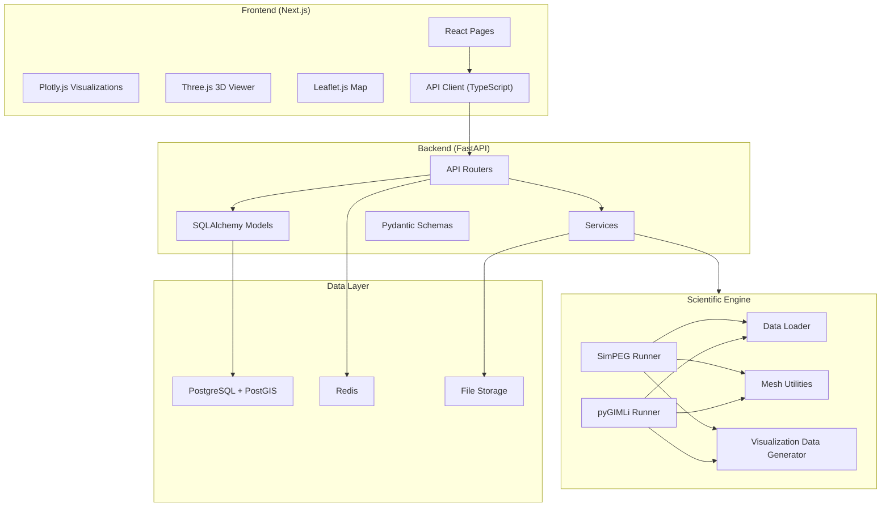
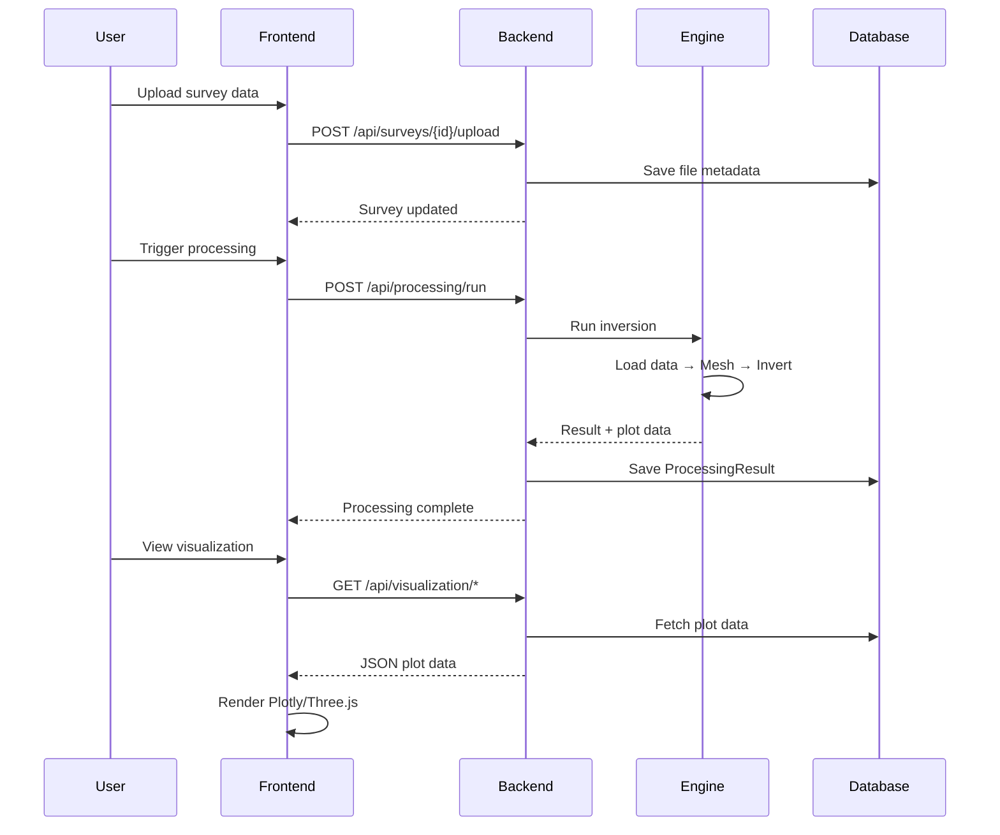

# System Architecture

## Overview

The GeoSurvey Platform follows a three-tier architecture with a clear separation between the presentation layer (frontend), business logic (backend API), and scientific computation (engine).

## Architecture Diagram

## Data Flow

## Module Descriptions

### Backend (FastAPI)
- **Routers**: 6 API route modules (projects, surveys, boreholes, processing, visualization, reports)
- **Models**: SQLAlchemy ORM with PostGIS geometry columns
- **Schemas**: Pydantic validation for all request/response payloads
- **Services**: File parsing (CSV, TXT, RES2DINV, OHM) and PDF report generation

### Scientific Engine
- **Data Loader**: Unified parser outputting NumPy arrays
- **Resistivity**: Geometric factor calculations for Wenner, Schlumberger, Dipole-Dipole
- **Mesh Utils**: Tensor (SimPEG) and unstructured (pyGIMLi) mesh generation
- **Runners**: SimPEG inversion and pyGIMLi ERT pipelines with demo fallbacks
- **Visualization Data**: Converts models to Plotly traces and Three.js mesh data

### Frontend (Next.js)
- **Pages**: Dashboard, Projects (list/detail), Surveys, Boreholes, Visualization Dashboard
- **Components**: Sidebar, TopBar, ProjectCard, FileUploader, EngineSelector, StatusBadge
- **Visualization**: ResistivityPlot (Plotly), SubsurfaceViewer (Three.js), SurveyMap (Leaflet), BoreholeLog
